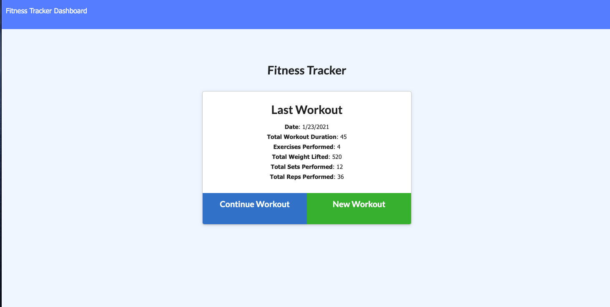
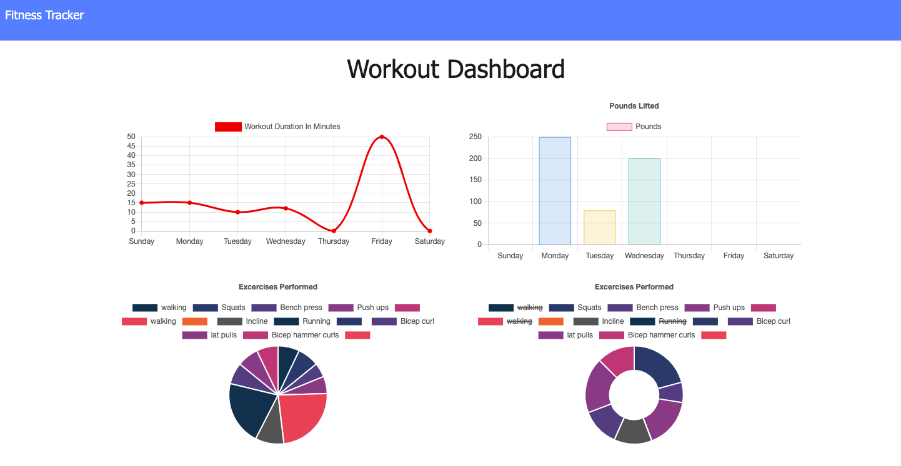

# My Fitness App

## Table of Contents

- [Description](#desciption)
- [Installation](#installation)
- [Usage](#Usage)
- [Contribution](#Contribution)
- [Test](#test)
- [License](#license)

## Description

[My Fitness App](https://shrouded-woodland-91273.herokuapp.com/)

My fitness app is the perfect application for anyone trying to track their workouts, stay motivated and keep their new years resolutions.
 
This application allows the user to track workouts on a daily. The user can submit a workout each day or multiple worksouts in one day. The options consist of cardio or resistance workouts. Once a workout is completed the next workout can be started(typically the next day). This application also has a dashboard which shows results and graphs or workout minutes and weight lifted.

## License

 
None

## Installation

npm i

## Usage

Application is deployed on Heroku.

## Contribution

N/A

## Test

Test can be ran on the deployed site.

## For any additional questions please contact me at:

Email: israelguillermo22@gmail.com
 
GitHub: [IsraelGuillermo](https://github.com/IsraelGuillermo)
